# Fashion Flex - E-commerce Website
### Flex your style, Define your fashion

Fashion Flex is a modern e-commerce platform built with ASP.NET Core. It allows users to browse and purchase clothing, manage their accounts, and securely process payments. The site features a clean design and responsive UI, making it accessible on various devices.

## Table of Contents
- Features
- Installation
- Usage
- Screenshots
- Technologies Used
- License

## Features

Fashion Flex is packed with several key features that provide a seamless shopping experience and efficient management tools for the site administrator.

### 1. User Authentication
   - **Secure Sign Up and Login**: Users can register and log in with an email and password.
     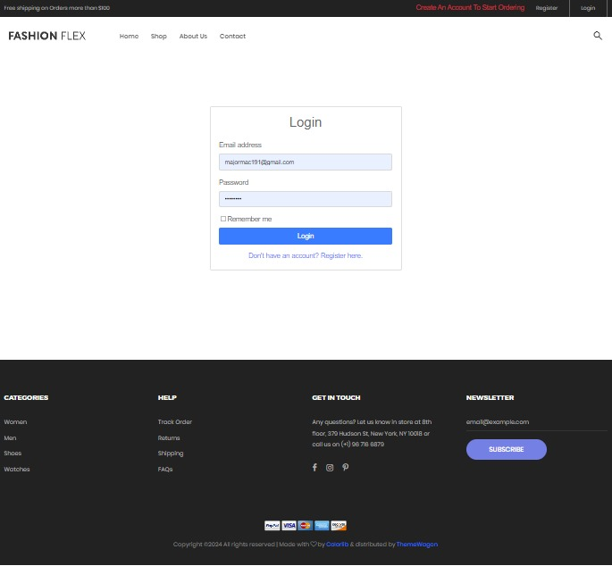
     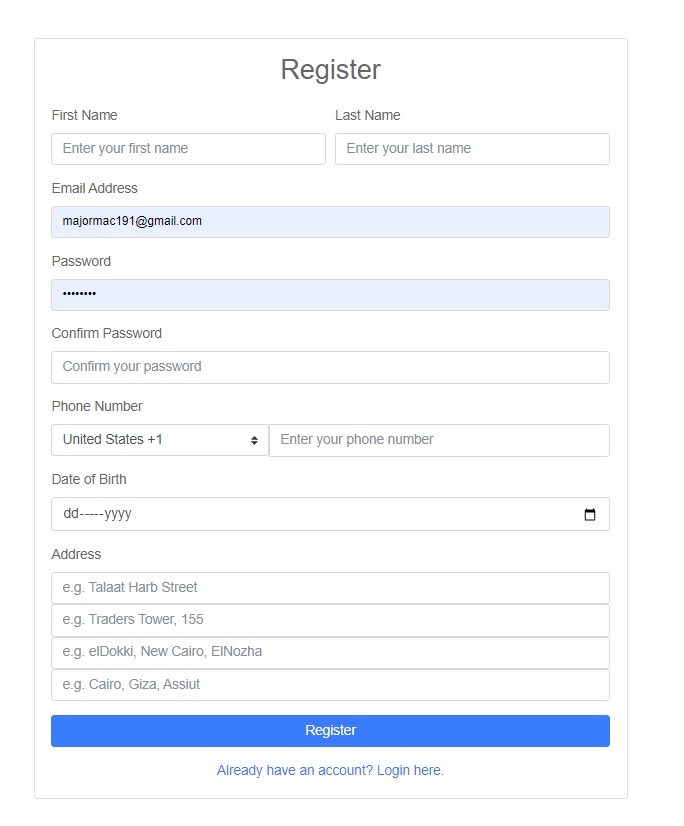

### 2. Product Browsing and Search
   - **Category Browsing**: Easily navigate products via clothing categories (e.g., Men, Women, Accessories).
   - **Product Search**: Search for products using keywords and filters.
   - **Filter by Attributes**: Filter products by price and newly added items.
     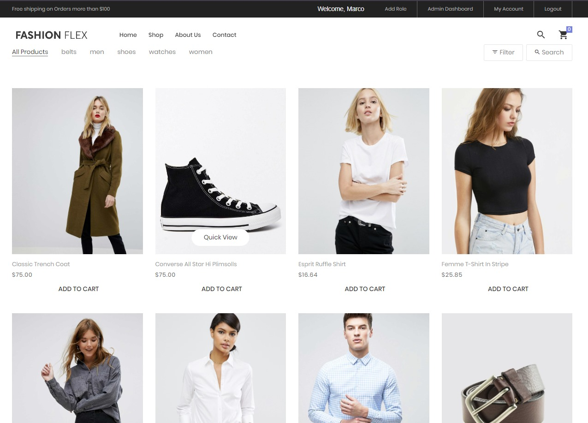
     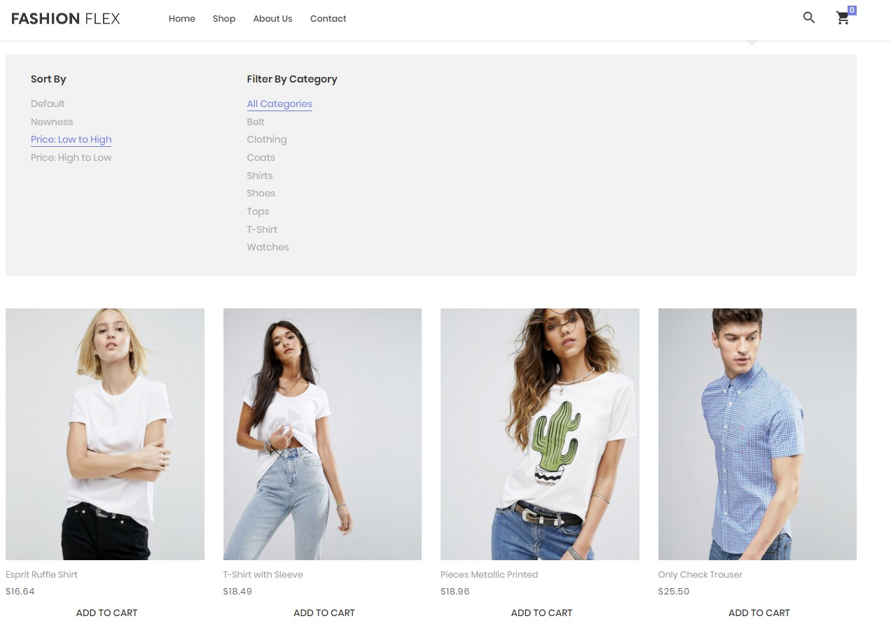

### 3. Product Details Page
   - **Detailed Product Information**: Includes product images, descriptions, pricing, available sizes, and customer reviews.
   - **Related Products**: Users are shown similar items based on the selected product.
     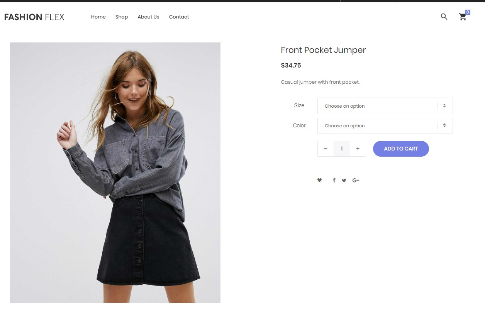

### 4. Shopping Cart
   - **Add to Cart**: Users can add products to their cart and see a summary of the cart contents.
   - **Cart Updates**: Easily modify the quantity or remove items from the cart.
   - **Persistent Cart**: The cart persists between sessions, allowing users to return to their items later.
     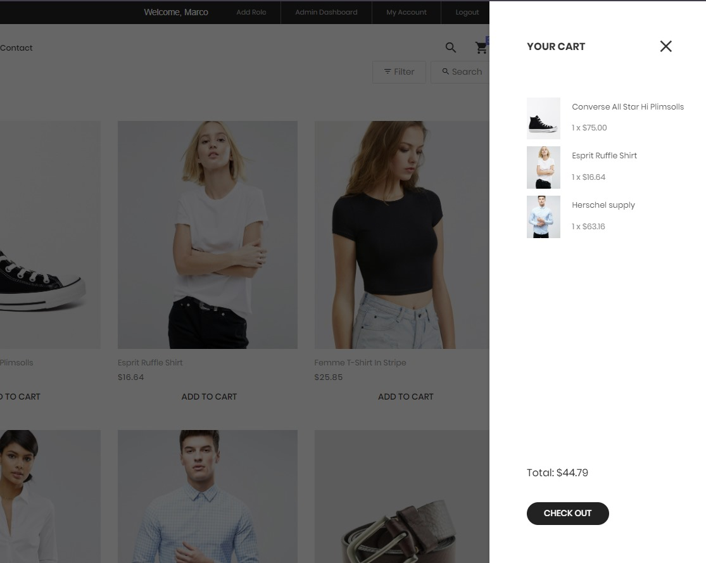

### 5. Checkout Process
   - **Secure Checkout**: Includes billing and shipping information, with integration for secure payment gateways using Stripe.
   - **Order Summary**: Users see a summary of their order before completing the purchase.
     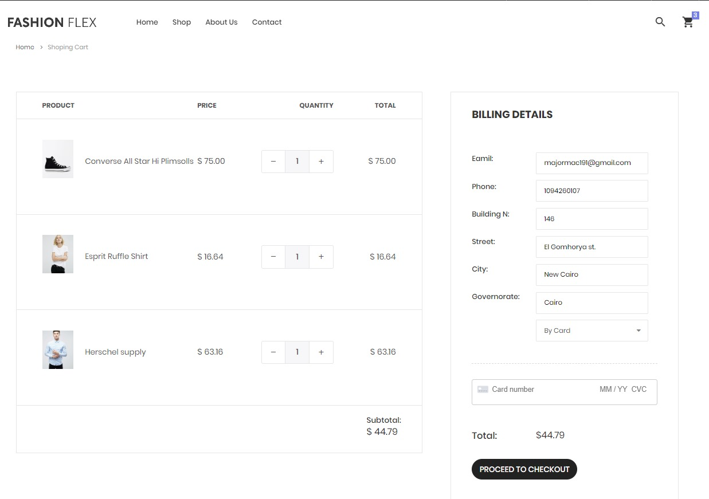 

### 6. User Account Management
   - **Profile **: Users can manage their personal information.

### 7. Admin Dashboard
   - **Home Page**: Displays dynamic statistics about customers, products, and orders using various charts (pie, line, bar), with data pulled directly from the database.
   - **Customer Management**: Monitor the current Customers and have authority to add new customers or delete them.
   - **Product Management**: Admins can add, update, or remove products.
   - **Order Management**: View and manage customer orders, including updating order status (e.g., shipped, delivered).
     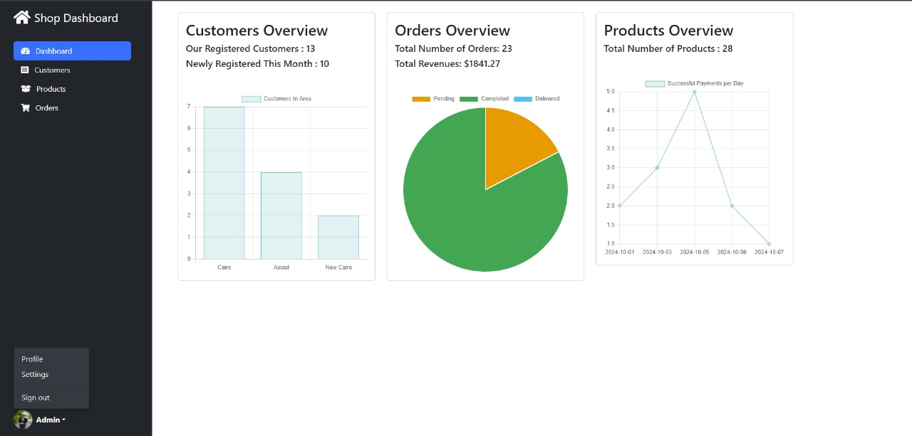
     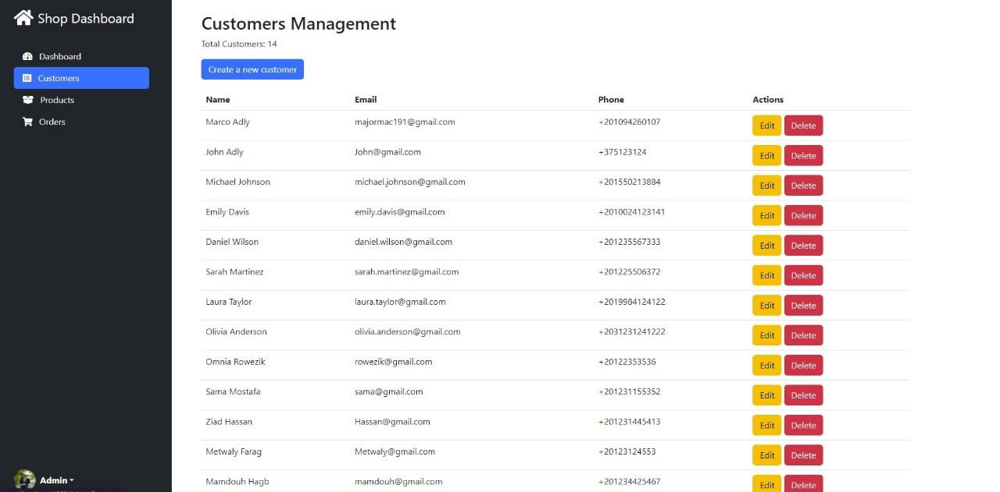
     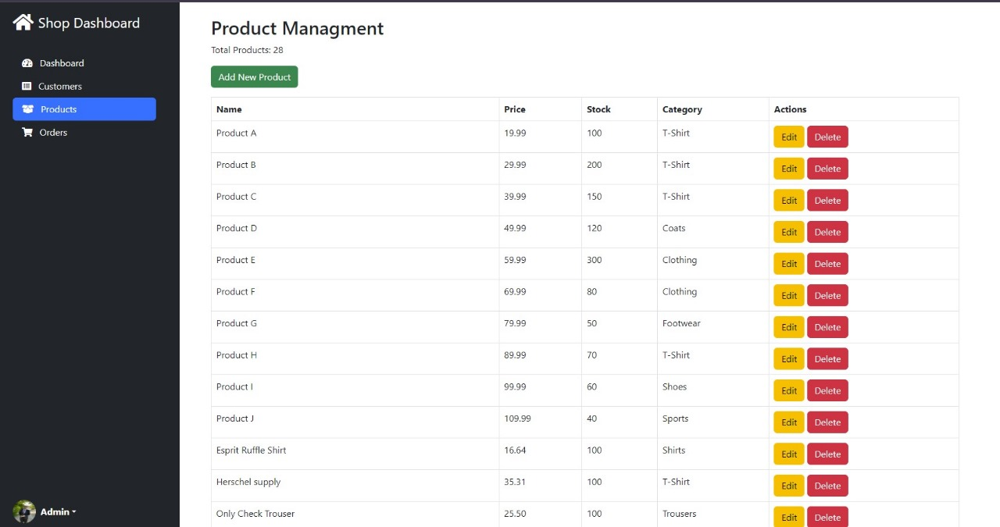
     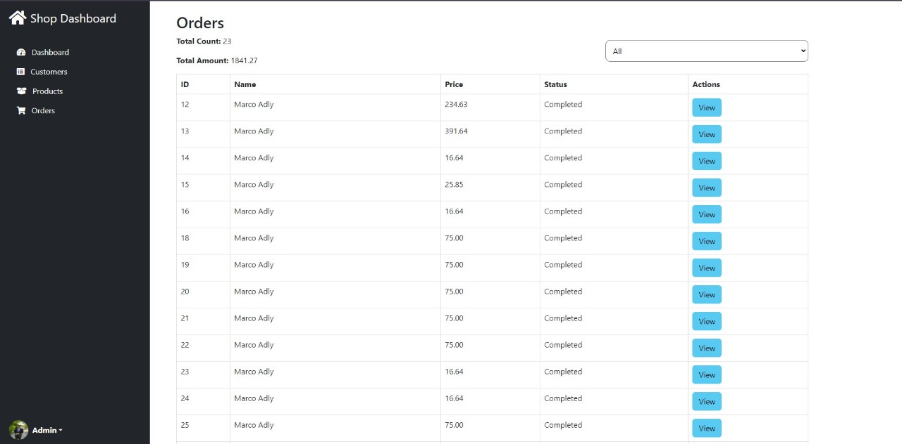

## Installation

1. Clone the repo
   ```bash
   git clone https://github.com/Omnia-Rowezak/Fashion-Flex.git
   ```
2. Set up the database from package manager console
   ```Update-Database
   ```

3. Insert your Stripe Key for a working payment gateway at checkout file
   ```var stripe = Stripe('your key');
   ```

### **Technologies Used**
- ASP.NET Core
- Entity Framework Core (for database)
- Bootstrap (for frontend)
- SQL Server (for the database you used)
- Stripe (integrated payment gateway)
